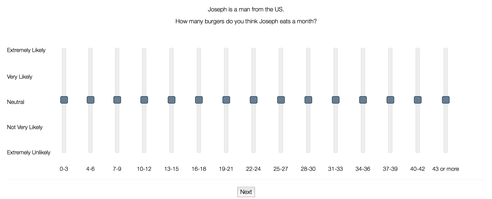
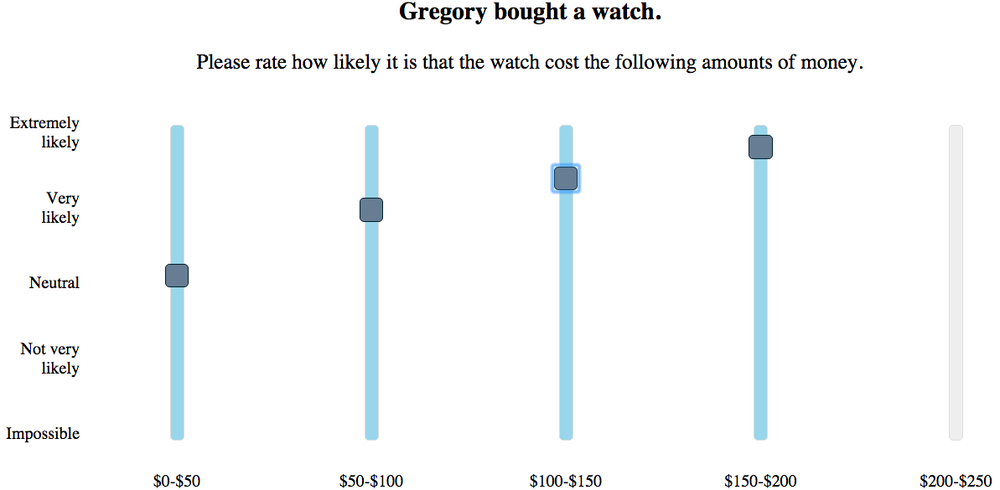
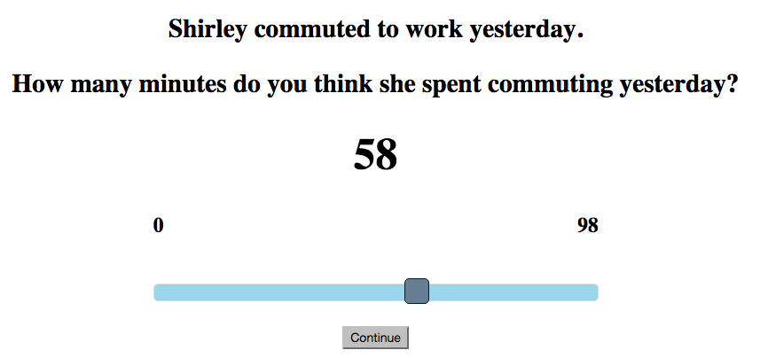
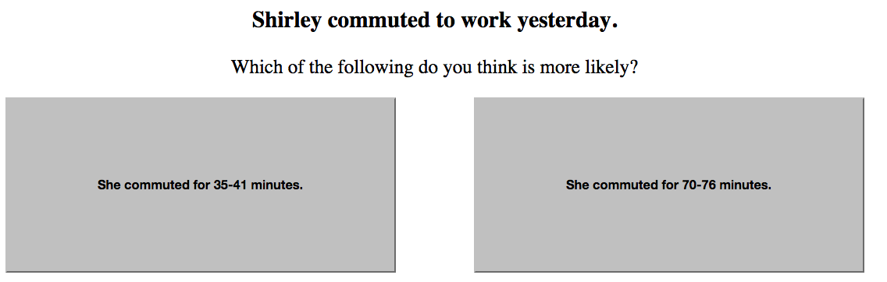

```{r setup, include=FALSE, echo = FALSE, message = FALSE}
knitr::opts_chunk$set(echo=TRUE, warning=FALSE, message=FALSE, dev.args = list(bg = 'transparent'), fig.align='center')
require('ggplot2')
require('reshape2')
require('coda')
require('ggmcmc')
require('rjags')
require('runjags')
require('dplyr')
require('gridExtra')
require('rstan')
theme_set(theme_bw() + theme(plot.background=element_blank()) )
```

## outline

<span style = "color:firebrick">Bayesian models of cognition</span>

- may require specifications of subjective beliefs

<span style = "color:white"> &nbsp; </span>

<span style = "color:firebrick">new experimental measure</span>

- binned histogram task (Kao et al., 2014)

<span style = "color:white"> &nbsp; </span>

<span style = "color:firebrick">Bayesian data analysis</span>

- great tool to specify and test ideas about how unobservables (like beliefs) relate to each other and how they generate observable data
  

## beliefs are latent

<span style = "color:firebrick">relevance</span>

- belief + desire + rationality $\Rightarrow$ action

<span style = "color:firebrick">problem</span>

- beliefs are latent, only action is directly observable

<span style = "color:white"> &nbsp; </span>

<div align = 'center'>
  
</div>


## focus: 1d continguous quantities

<span style = "color:firebrick">context</span>

Joe is an adult male from Texas. He went to a BBQ party yesterday.

<div style = "float:left; width:45%;">
<span style = "color:firebrick">sentence</span>

Joe ate many burgers.  

<span style = "color:white"> &nbsp; </span>
</div>
<div style = "float:right; width:45%;">
<span style = "color:firebrick">cardinal surprise reading</span>

Joe ate more than expected.

<span style = "color:white"> &nbsp; </span>
</div>  

<span style = "color:white"> &nbsp; </span>

<div style = "float:left; width:45%;">
```{r, echo = FALSE, fig.align='left', fig.width=3.5, fig.height=2.7}
bb = function(n,a,b) {
  sapply(0:n, function(k) choose(n,k) * beta(k+a,n-k+b) / beta(a,b))
}
theta = 0.8
MyDF<-data.frame(x = 0:25,
                 y = bb(25, 3, 10))
cutoff = max(which(cumsum(MyDF$y) <= theta)) - 1
p <-ggplot(MyDF, aes(x = x, y = y)) + geom_bar(stat = "identity", fill = "gray") +
  # geom_bar(data = filter(MyDF, x <= cutoff), stat = "identity", fill = "firebrick") +
  xlab("n") + ylab("") + 
  ggtitle("P(Joe ate n)")
show(p)
```  
</div>
<div style = "float:right; width:45%;">
```{r, echo = FALSE, fig.align='left', fig.width=3.5, fig.height=2.7}
MyDF2 = data.frame(x = 0:25,
                   y = cumsum(bb(25, 3, 10)))
cutoff = max(which(MyDF2$y <= theta)) - 1
p2 <-ggplot(MyDF2, aes(x = x, y = y)) + geom_bar(stat = "identity", fill = "gray") +
  geom_bar(data = filter(MyDF2, x <= cutoff), stat = "identity", fill = "firebrick") +
  xlab("n") + ylab("") +
  geom_hline(aes(yintercept=theta), color = "firebrick") +
  annotate("text", x = 3, y = 0.85, label = "theta = 0.8") +
  ggtitle("P(Joe ate n or less)")
show(p2)
```  
</div>  

<!--

<div style = "position:absolute; top: 620px; right:60px; color:darkblue;">
  (e.g., Schoeller & Franke 2015)
</div>

-->
## how to determine beliefs?

<span style = "color:firebrick">real-world frequencies</span>

- may not exist
- subjects may not be aware

<span style = "color:white"> &nbsp; </span>

<span style = "color:firebrick">experimental measures</span>

- give-number task & inference of parameterized distribution 
    - e.g., Manski (2004); Tauber & Steyvers (2013)
    - <span style = "font-style: italic">scoring rules</span> (Savage, 1971)
- iterated learning tasks (Lewandowsky, Griffiths, & Kalish, 2009)
- <span style = "color:firebrick">binned histogram task</span> (Kao et al., 2014)

<!--
## BH task

<div align = 'center'>
  
</div>

take average normalized slider ratings to reflect population-level belief


-->

# experiment

## overview

- 50 participants recruited via MTurk
- each saw every condition of every task
- 8 items (from previous research)
- 3 task types:
    - <span style = "color:firebrick">BH</span>: binned histogram
    - <span style = "color:firebrick">GAN</span>: give-a-number
    - <span style = "color:firebrick">PC</span>: paired comparison

## items

<div style = "position:absolute; top: 110px; left:50px;">

1. "X has just fetched himself a cup of <span style = "color:firebrick">coffee</span> from the office vending machine."
    - "What do you think the temperature of his coffee is?"  
    
2. "X <span style = "color:firebrick">commuted</span> to work yesterday."  
    - "How many minutes do you think she spent commuting yesterday?"
    
3. "X told a <span style = "color:firebrick">joke</span> to N kids."   
    - "How many of the kids do you think laughed?"
    
4. "X bought a <span style = "color:firebrick">laptop</span>."         
    - "How much do you think it cost?"
    
5. "X threw N <span style = "color:firebrick">marbles</span> into a pool."
    - "How many of the marbles do you think sank?"

6. "X just went to the <span style = "color:firebrick">movies</span> to see a blockbuster."
    - "How many minutes long do you think the movie was?"

7. "X watched <span style = "color:firebrick">TV</span> last week."
    - "How many hours do you think he spent watching TV last week?"

8. "X bought a <span style = "color:firebrick">watch</span>."
    - "How much do you think it cost?"
                                        
</div>
    

## BH task


<div align = 'center'>
  
</div>

<span style = "color:white"> dummy </span>


normalize slider rating by subject $\Rightarrow$ average over subjects $\Rightarrow$ <span style = "color:firebrick">BH task averages</span>

## GAN task

<span style = "color:white"> dummy </span>

<div align = 'center'>
  
</div>

## PC task

<span style = "color:white"> dummy </span>

<div align = 'center'>
  
</div>

# results

## BH task averages

<div align = 'center'>
  
</div>

## GAN frequencies

<div align = 'center'>
  
</div>

## PC choice proportions

<div align = 'center'>
  
</div>

# Bayesian inference

## agenda

<span style = "color:firebrick">goal: scrutinize BH task</span>

- do BH task averages approximate the central tendency of beliefs in the population?

<span style = "color:white"> dummy </span>

<span style = "color:firebrick">approach: hieararchical Bayesian modeling</span>

- take data from all three tasks
- infer latent subjective & "population-level beliefs"
- specify "link functions"
    - how do subjective beliefs generate observable data

<span style = "color:white"> dummy </span>

<!--

<span style = "color:firebrick">main technical questions</span>

- how do individual-level beliefs relate to population level beliefs?
    - "population-level belief" => central tendency of subjective beliefs
    - think: "mean of a Gaussian hyperprior"
- how do subjective beliefs give rise to observable choices in the three tasks?

-->

```{r, echo = FALSE}
load('//Users/micha/Desktop/data/svn/priors/models/04_Exp2_Manski_JAGS/data/processed_data.RData')
```


## model

<div style = "position:absolute; top: 100px; left:100px;">
  
</div>

## set-up

- implemented in JAGS
- 50,000 samples after a burn in of 100,000
- convergence checks: visually and $\hat{R}$

## population-level beliefs $Q_j$

<div align = 'center'>
  
</div>

<div style = "position:absolute; top: 620px; right:60px;">
<span style = "color:firebrick">red</span>: BH task averages; <span style = "color:black">black</span>: mean posterior $Q_i$; <span style = "color:grey">grey</span>: 95% HDIs
</div>

## individual vs. population-level beliefs

<div align = 'center'>
  
</div>

<div style = "position:absolute; top: 620px; right:60px;">
<span style = "color:black">black</span>: mean posterior $Q_i$; <span style = "color:grey">grey</span>: mean posterior $P_{ij}$
</div>

## upshot

<span style = "color:white"> &nbsp; </span>

<span style = "color:white"> &nbsp; </span>

- subjective beliefs $P_{ij}$ may differ from population-level mean (good!)

<span style = "color:white"> &nbsp; </span>

- BH task averages reasonably approximate mean $Q_j$ (excellent!)

# model criticism

## PPC averaged normalized slider

<div align = 'center'>
  
</div>

<div style = "position:absolute; top: 620px; right:60px;">
<span style = "color:firebrick">red</span>: observed data; <span style = "color:black">black</span>: mean posterior prediction with 95% HDIs
</div>

## PPC number choice

<div align = 'center'>
  
</div>

<div style = "position:absolute; top: 620px; right:60px;">
<span style = "color:firebrick">red</span>: observed data; <span style = "color:black">black</span>: mean posterior prediction with 95% HDIs
</div>

## PPC lightning round

<div align = 'center'>
  
</div>

<div style = "position:absolute; top: 620px; right:60px;">
<span style = "color:firebrick">red</span>: observed data; <span style = "color:black">black</span>: mean posterior prediction with 95% HDIs
</div>
    
# conclusions

## conclusions

<span style = "color:white"> dummy </span>


- BH task averages are practical and reasonable approximations of the population-level central tendency of individual beliefs

<span style = "color:white"> dummy </span>


- Bayesian data analysis is a great tool to specify and test ideas about how unobservables (like beliefs) relate to each other and how they generate observable data
    - inferences based on diverse data from different tasks


# modeling details

## model

<div style = "position:absolute; top: 100px; left:100px;">
  
</div>

## hierarchical population prior

- $w \sim \text{Gamma}(2,0.1)$
- $Q_{j}  \sim \text{Dirichlet}(1,\dots, 1)$
- $P_{ij} \sim \text{Dirichlet}(w Q_j)$

<span style = "color:white"> dummy </span>


<div style = "float:left; width:45%;">
`w = 20`
```{r, echo = FALSE, fig.align='center', fig.width=4, fig.height=3}
library('gtools')
p = c(0, 1, 1.4, 2, 4, 4.2, 4.1, 3.7, 4, 3.1, 2, 1.6, 0.8, 0.2)
p = p/sum(p)
ggplot(melt(rdirichlet(alpha= p*20, n = 10)), aes(x = Var2, y = value, fill = factor(Var1), color = "gray")) + geom_line(color = "gray") + geom_line(data = cbind(melt(p), x=1:14, Var1 = "a"), aes(x = x, y = value, color = "red")) + theme(legend.position="none") + xlab("") + ylab("")
```  
</div>
<div style = "float:right; width:45%;">
`w = 200`
```{r, echo = FALSE, fig.align='center', fig.width=4, fig.height=3}
ggplot(melt(rdirichlet(alpha= p*200, n = 10)), aes(x = Var2, y = value, fill = factor(Var1), color = "gray")) + geom_line(color = "gray") + geom_line(data = cbind(melt(p), x=1:14, Var1 = "a"), aes(x = x, y = value, color = "red")) + theme(legend.position="none") + xlab("") + ylab("")
```  
</div>  


## link function: BH task

- $\kappa \sim \text{Gamma}(5,5)$
- $\sigma \sim \text{Gamma}(0.0001, 0.0001)$
- $s_{ijk} \sim  \text{logistic}(\text{Norm}(\text{logit}(P_{ijk}), \sigma), \kappa)$

```{r, echo = FALSE}
library(ggplot2)
library(reshape2)

# sequence of subjective probabilities for a given bin and item
pijks = seq(0.0000001,.9999999, length.out = 101) 

logit = function(x, k = 1){
  k * log(x / (1-x))
} 

logistic = function(x, k = 1, zero = 0) {
  # k is steepness of the curve
  return(1 / (1 + exp(-1/k*(x - zero))))
}

sd = 0.5 # global Gaussian noise
k = 1 # global steepness of logistic transform (has to be 1 in JAGS)
kLogit = 1.2 # global steepness of logit transform
        # (kLogit > k : end-point averse, kLogit < k: end-point loving )


noiseIV = function(x, sd = 0.25, percentile = .25){
  # get percentiles to see how much noise affects choices
  # per default we get the 95% CI about where noise-perturbations would lie
  return(sapply(x, function(y) qnorm(p = c(percentile, 1- percentile), mean = y, sd = sd)))
}

uplow = noiseIV(logit(pijks, kLogit), sd = sd)

plotData = data.frame(p = pijks,
                      lower = logistic(uplow[1,],k),
                      upper = logistic(uplow[2,],k),
                      mean = logistic(logit(pijks, kLogit),k))
plotDataMelted = melt(plotData, id.vars = c("p"))

myPlot = ggplot(plotDataMelted, aes(x = p, y = value, color = variable)) + geom_line() + xlab("P_ijk") + ylab("probability of S_ijk")


sd = 1.5 # global Gaussian noise
k = 1 # global steepness of logistic transform (has to be 1 in JAGS)
kLogit = 2 # global steepness of logit transform
        # (kLogit > k : end-point averse, kLogit < k: end-point loving )


noiseIV = function(x, sd = 0.25, percentile = .25){
  # get percentiles to see how much noise affects choices
  # per default we get the 95% CI about where noise-perturbations would lie
  return(sapply(x, function(y) qnorm(p = c(percentile, 1- percentile), mean = y, sd = sd)))
}

uplow = noiseIV(logit(pijks, kLogit), sd = sd)

plotData = data.frame(p = pijks,
                      lower = logistic(uplow[1,],k),
                      upper = logistic(uplow[2,],k),
                      mean = logistic(logit(pijks, kLogit),k))
plotDataMelted = melt(plotData, id.vars = c("p"))

myPlot2 = ggplot(plotDataMelted, aes(x = p, y = value, color = variable)) + geom_line() + xlab("P_ijk") + ylab("probability of S_ijk")

```

<span style = "color:white"> dummy </span>

<div style = "float:left; width:45%;">
`kappa = 1.2, sigma = 0.5`
```{r, echo = FALSE, fig.align='center', fig.width=4, fig.height=3}
show(myPlot)
```  
</div>
<div style = "float:right; width:45%;">
`kappa = 2, sigma = 1.5`
```{r, echo = FALSE, fig.align='center', fig.width=4, fig.height=3}
show(myPlot2)
```  
</div>  

## link function: GAN task

- $a \sim \text{Gamma}(2,1)$
- $n_{ij} \sim \text{Categorical}(\text{exp}(a P_{ij}))$

<span style = "color:white"> dummy </span>

```{r, echo = TRUE, eval = FALSE}
qplot(sample(x = 5, size = 1000, replace = TRUE, prob = exp(a *(1:5))))
```

<div style = "float:left; width:45%;">
`a = 0.5`
```{r, echo = FALSE, fig.align='center', fig.width=4, fig.height=3}
qplot(sample(x = 5, size = 1000, replace = TRUE, 
             prob = exp(0.5 *(1:5)))) + 
  xlab("choice") + ylab("frequency")
```
</div>
<div style = "float:right; width:45%;">
`a = 1.5`
```{r, echo = FALSE,fig.align='center', fig.width=4, fig.height=3}
qplot(sample(x = 5, size = 1000, replace = TRUE, 
             prob = exp(1.5 *(1:5)))) + 
  xlab("choice") + ylab("frequency")
```  
</div>  

## link function: PC task

- $b \sim \text{Gamma}(2,1)$
- $c_{ijl} \sim \text{Bern}(\text{exp}(b \ (p^{\text{high}}_{ijl}, p^{\text{low}}_{ijl}))$

$$p^\text{high}_{ijl} = \begin{cases} 2 & \text{if $mode(P_{ij})$ is closer to higher} \\
& \text{ bin of $l$ than to lower bin }  \\ 1 & \text{if equal
            distance} \\ 0 & \text{otherwise}  \end{cases}$$

$$p^\text{low}_{ijl} = 2 - p^\text{high}_{ijk}$$

<span style = "color:firebrick">example</span>

- what's more likely: John scored 10-12, or John scored 26-28 points?
- subjective belief says: most likely John scored 14-16
- lower bin is closer, so it's more likely to be chosen

## posterior over parameters

<div align = 'center'>
  
</div>

## posterior predictive p-values

<div align = 'center'>
  
</div>
